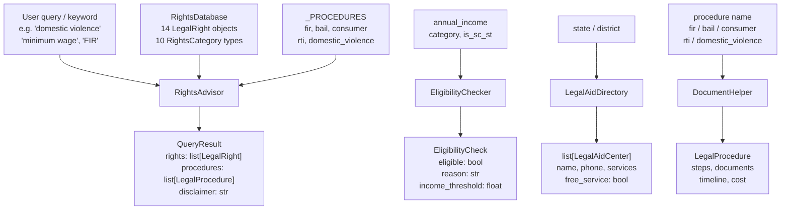

# aumai-nyayasetu

**Legal aid and rights awareness for underserved communities in India.**

Part of the [AumAI](https://github.com/aumai) open source suite for agentic AI infrastructure.

[](https://github.com/aumai/aumai-nyayasetu/actions)
[](https://pypi.org/project/aumai-nyayasetu/)
[](LICENSE)
[](https://python.org)

> **Legal Disclaimer:** This tool does not provide legal advice. All information is for
> general awareness only. Consult a qualified legal professional before taking any legal
> action.

---

## What is this?

"Nyaya" means justice in Sanskrit. "Setu" means bridge. aumai-nyayasetu is a bridge
between ordinary people and the Indian legal system.

Most people in India who experience rights violations — wage theft, domestic violence,
caste atrocities, consumer fraud — do not pursue legal remedies. Not because they lack
rights. India has some of the most comprehensive rights legislation in the world. They do
not pursue remedies because they do not know those rights exist, do not know which
documents to gather, do not know where to go, and cannot afford a lawyer to explain it.

aumai-nyayasetu addresses the information gap. It encodes 14 fundamental legal rights
across 10 categories, step-by-step procedures for five common legal actions, a directory
of seven District Legal Services Authority (DLSA) centres, and an income-based eligibility
checker for free legal aid — all in a single Python package that runs offline, on a laptop,
in a village.

---

## Why does this matter? (First principles)

A right that a person does not know they have is, practically speaking, not a right at all.

The Indian legal system has strong protections for marginalised groups — Scheduled
Castes/Tribes, women, children, workers, persons with disabilities — but these protections
require the beneficiary to initiate action. Filing an FIR, approaching a Protection Officer,
filing at a Consumer Forum, submitting an RTI — each requires knowing what to file, where,
with what documents, within what time limit.

Legal aid is free by law for persons with annual income below Rs 3 lakh (Rs 5 lakh for
SC/ST). But most eligible people do not know this. aumai-nyayasetu makes this information
accessible programmatically: to NGO field workers, legal aid volunteers, gram panchayat
members, and developers building rights-awareness applications.

---

## Architecture



---

## Features

- **14 legal rights** across 10 categories: fundamental, labour, consumer, property,
  family, criminal defence, women, children, SC/ST, and disability.
- **10 `RightsCategory` enum values** for structured filtering.
- **Keyword search** across right names, descriptions, and relevant laws.
- **5 step-by-step legal procedures**: FIR, bail application, consumer complaint, RTI, and
  domestic violence complaint — each with documents needed, timeline, and cost.
- **Income-based eligibility checker** for free legal aid (Rs 3L general threshold, Rs 5L
  for SC/ST). Special categories (women, children, SC/ST, disability, custody,
  trafficking victims) are income-exempt.
- **7 DLSA centre records** covering Delhi, Mumbai, Bangalore, Chennai, Kolkata, Hyderabad,
  and Lucknow, searchable by state or district.
- **JSON output mode** on the `rights` CLI command for downstream integration.
- **Built-in disclaimer** on every `QueryResult` and every CLI output — cannot be disabled.
- **Type-safe** — full Pydantic v2 models throughout.

---

## Quick Start

### Prerequisites

- Python 3.11 or higher
- `pip install aumai-nyayasetu`

### CLI usage

**Search rights by keyword:**

```bash
nyayasetu rights --search "minimum wage"
```

**Browse rights by category:**

```bash
nyayasetu rights --category labor
```

Available categories: `fundamental`, `labor`, `consumer`, `property`, `family`,
`criminal_defense`, `women`, `children`, `sc_st`, `disability`.

**Get rights as JSON (for integration):**

```bash
nyayasetu rights --category women --json-output
```

**Check eligibility for free legal aid:**

```bash
nyayasetu eligible --income 250000
nyayasetu eligible --income 450000 --sc-st
nyayasetu eligible --income 0 --category women
```

**Find legal aid centres near you:**

```bash
nyayasetu centers --state Delhi
nyayasetu centers --district Mumbai
nyayasetu centers   # list all
```

**Get document checklist for a procedure:**

```bash
nyayasetu documents --procedure fir
nyayasetu documents --procedure domestic_violence
nyayasetu documents --procedure consumer
nyayasetu documents --procedure rti
nyayasetu documents --procedure bail
```

**Get matched rights and procedures for a described issue:**

```bash
nyayasetu help --query "my employer is not paying minimum wages"
nyayasetu help --query "police not registering my FIR"
nyayasetu help --query "husband threatening domestic violence"
```

### Python API

```python
from aumai_nyayasetu.core import RightsAdvisor, EligibilityChecker, LegalAidDirectory
from aumai_nyayasetu.models import RightsCategory

# Keyword-based advice
advisor = RightsAdvisor()
result = advisor.advise("minimum wage not paid")
for right in result.rights:
    print(f"[{right.code}] {right.name} — {right.relevant_law}")
for proc in result.procedures:
    print(f"Procedure: {proc.name}")
print(result.disclaimer)

# Eligibility check
checker = EligibilityChecker()
check = checker.check(annual_income=200000)
print(f"Eligible: {check.eligible} — {check.reason}")

# Find aid centres
directory = LegalAidDirectory()
centres = directory.find_by_state("Delhi")
for centre in centres:
    print(f"{centre.name}: {centre.phone}")
```

---

## CLI Reference

All commands are accessed via the `nyayasetu` entry point.

### `rights`

Search and list legal rights.

```
nyayasetu rights [--category CATEGORY] [--search QUERY] [--json-output]
```

| Option | Description |
|--------|-------------|
| `--category` | Filter by category enum value (see list below) |
| `--search` | Keyword search across name, description, and law |
| `--json-output` | Output as JSON array (skips human-readable format) |

Valid `--category` values: `fundamental`, `labor`, `consumer`, `property`, `family`,
`criminal_defense`, `women`, `children`, `sc_st`, `disability`.

If neither `--category` nor `--search` is provided, all 14 rights are listed.

---

### `eligible`

Check eligibility for free legal aid.

```
nyayasetu eligible --income AMOUNT [--category CATEGORY] [--sc-st]
```

| Option | Required | Description |
|--------|----------|-------------|
| `--income` | Yes | Annual income in INR (rupees) |
| `--category` | No | Special category: `women`, `children`, `sc_st`, `disability`, `custody`, `trafficking_victim` |
| `--sc-st` | No | Flag — applicant is SC or ST (raises income threshold to Rs 5,00,000) |

Income thresholds: Rs 3,00,000 (general), Rs 5,00,000 (SC/ST). Income-exempt categories:
women, children, sc_st, disability, custody, trafficking_victim.

---

### `centers`

Find legal aid centres near you.

```
nyayasetu centers [--state STATE] [--district DISTRICT]
```

| Option | Description |
|--------|-------------|
| `--state` | Filter by state name (case-insensitive partial match) |
| `--district` | Filter by district name (case-insensitive partial match) |

If no option is provided, all 7 known DLSA centres are listed.
Also prints national helplines: NALSA 15100, Women Helpline 181, Childline 1098.

---

### `documents`

Get document checklist and step-by-step procedure for a legal action.

```
nyayasetu documents --procedure PROCEDURE
```

| Option | Required | Description |
|--------|----------|-------------|
| `--procedure` | Yes | Procedure key: `fir`, `bail`, `consumer`, `rti`, `domestic_violence` |

Output includes: procedure name, description, ordered steps, documents needed, timeline,
and cost.

---

### `help`

Get matched rights and procedures for a described legal issue.

```
nyayasetu help --query "describe your issue here"
```

| Option | Required | Description |
|--------|----------|-------------|
| `--query` | Yes | Natural-language description of the legal issue |

Matching is keyword-based against right names, descriptions, and law references, plus
procedure keyword matching (e.g. `fir`, `police`, `bail`, `consumer`, `rti`, `domestic`,
`violence`).

---

## Python API Examples

### Searching rights by code

```python
from aumai_nyayasetu.core import RightsDatabase

db = RightsDatabase()

# Get by code
right = db.get_by_code("FR-04")
print(right.name)          # Right to Life and Liberty
print(right.relevant_law)  # Article 21, Constitution of India
print(right.how_to_claim)

# Get all rights
all_rights = db.all_rights()
print(f"Total rights: {len(all_rights)}")
```

### Checking eligibility with special categories

```python
from aumai_nyayasetu.core import EligibilityChecker

checker = EligibilityChecker()

# Women are income-exempt
result = checker.check(annual_income=999999, category="women")
print(result.eligible)   # True
print(result.reason)     # "Eligible as women (income waived)"

# SC/ST applicant with elevated threshold
result = checker.check(annual_income=450000, is_sc_st=True)
print(result.eligible)   # True — within Rs 5,00,000 threshold

# General applicant above threshold
result = checker.check(annual_income=500000)
print(result.eligible)   # False

# Negative income — raises ValueError
try:
    checker.check(annual_income=-1)
except ValueError as exc:
    print(exc)  # "annual_income must be non-negative, got -1"
```

### Using DocumentHelper

```python
from aumai_nyayasetu.core import DocumentHelper

helper = DocumentHelper()

# Get by exact key
proc = helper.get_procedure("fir")
print(proc.name)         # Filing an FIR
print(proc.timeline)     # Must be registered immediately
print(proc.cost)         # Free
for step in proc.steps:
    print(f"  {step}")

# Get by partial name match
proc = helper.get_procedure("Consumer")  # fuzzy name lookup
print(proc.name)         # Consumer Complaint

# List all procedures
all_procs = helper.all_procedures()
print([p.name for p in all_procs])
```

---

## Configuration

aumai-nyayasetu has no external configuration file. All behaviour is controlled through
the Python API and CLI flags.

Key thresholds (defined in `core.py`):

| Constant | Value | Meaning |
|----------|-------|---------|
| `EligibilityChecker.GENERAL_THRESHOLD` | `300000.0` | Income limit for general category free aid |
| `EligibilityChecker.SC_ST_THRESHOLD` | `500000.0` | Income limit for SC/ST free aid |
| `EligibilityChecker.EXEMPT` | set of strings | Categories exempt from income criteria |

---

## Technical Deep-Dive

### Rights matching in RightsAdvisor

`RightsAdvisor.advise` performs two independent lookups:

1. **Rights lookup** — calls `RightsDatabase.search(query)` which checks if the lowercased
   query string appears in `name.lower()`, `description.lower()`, or `relevant_law.lower()`
   for each `LegalRight`.
2. **Procedure lookup** — maps five procedure keys (`fir`, `bail`, `consumer`, `rti`,
   `domestic_violence`) to trigger-keyword lists. If any keyword in a list appears in the
   lowercased query, the corresponding `LegalProcedure` is included in the result.

Both lookups run against in-memory data; there is no database or network call.

### EligibilityChecker logic

Categories in `EligibilityChecker.EXEMPT` bypass income comparison entirely. For all
other cases, the threshold is `SC_ST_THRESHOLD` when `is_sc_st=True`, otherwise
`GENERAL_THRESHOLD`. The check returns `eligible=True` when
`annual_income <= threshold`.

### Disclaimer enforcement

`QueryResult.disclaimer` is a required field with a default value — it cannot be set to
an empty string by callers. Every CLI command prints the disclaimer string after output.
This design ensures the disclaimer cannot be accidentally omitted in downstream integrations
that use `QueryResult` objects.

---

## Integration with Other AumAI Projects

| Project | Integration point |
|---------|-------------------|
| **aumai-edumentor** | Cross-reference Right to Education (FR-05) when learners are denied school admission |
| **aumai-specs** | Validate `EligibilityCheck` and `QueryResult` objects at API boundaries |

---

## Installation

```bash
pip install aumai-nyayasetu
```

Development install:

```bash
git clone https://github.com/aumai/aumai-nyayasetu
cd aumai-nyayasetu
pip install -e ".[dev]"
pytest
```

---

## License

Apache 2.0. See [LICENSE](LICENSE).

## Part of AumAI

This project is part of [AumAI](https://github.com/aumai) — open source infrastructure for
the agentic AI era.
